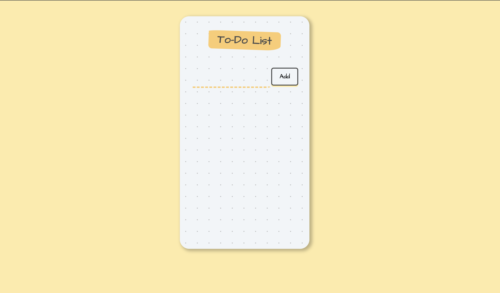

# Appbrewery - TinDog Startup Website Solution

This is a solution to the TinDog Startup Website Project from Appbrewery.com

## Table of contents

- [Overview](#overview)
  - [The challenge](#the-challenge)
  - [Screenshot](#screenshot)
- [My process](#my-process)
  - [Built with](#built-with)
  - [What I learned](#what-i-learned)
- [Author](#author)

## Overview

### The challenge

Users should be able to:

- View the optimal layout depending on their device's screen size
- See hover and focus states for interactive elements

### Screenshot

## My process

### Built with

- Semantic HTML5 markup
- CSS custom properties
- Bootstrap

### What I learned

Using Bootstrap components, snippets to build websites easily

## Author

- Twitter - [@sanjayvjacob](https://www.twitter.com/sanjayvjacob)